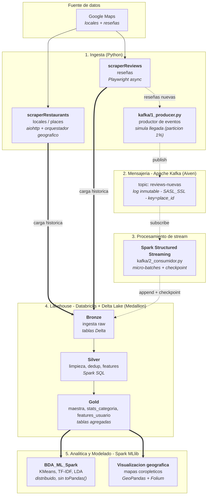

# bda-pi — Big Data Analytics de Reseñas Gastronómicas del Perú

Pipeline de datos de extremo a extremo sobre el sector gastronómico peruano: ingesta
masiva de locales y reseñas de Google Maps, consolidación en una arquitectura
Medallion sobre Databricks, modelado analítico distribuido con Spark MLlib e ingesta
incremental en tiempo real mediante Apache Kafka y Spark Structured Streaming.

Proyecto académico — Universidad del Pacífico (UP), curso de Big Data Analytics.

---

## Arquitectura

El proyecto implementa una arquitectura híbrida **Batch + Kappa** sobre un mismo
lakehouse Delta (patrón Medallion). El diagrama muestra los componentes lógicos
(qué hace cada etapa) anotados con sus componentes tecnológicos (con qué se
implementa). La línea sólida representa el camino **batch**; la línea punteada, el
camino **streaming (Kappa)**.



### Camino batch

La carga histórica (los ~3.4 M de reseñas ya scrapeadas) se ingesta directamente a la
capa Bronze y se procesa por reprocesamiento completo a través de Bronze → Silver →
Gold. Es la vía de alto volumen y alta latencia: produce las tablas Gold sobre las que
corren los modelos y los análisis.

### Camino Kappa (streaming)

Para los datos nuevos, el sistema sigue el estilo **Kappa**: un único motor de
procesamiento (Spark Structured Streaming) consume un **log de eventos inmutable**
(el topic de Kafka) y escribe de forma incremental al mismo lakehouse. No existe una
ruta de código batch paralela para los datos recientes; el reprocesamiento, si se
requiere, se hace **reproduciendo el log** desde el offset deseado
(`startingOffsets=earliest`) con el mismo código de streaming.

---

## Por qué Batch + Kappa y no Lambda

La arquitectura **Lambda** mantiene dos rutas de procesamiento separadas —una *batch
layer* y una *speed layer*— y una *serving layer* que **fusiona** ambas vistas para
responder consultas. Su principal inconveniente operativo es la **duplicación de
lógica**: la misma transformación debe implementarse y mantenerse dos veces (en batch
y en streaming), con el riesgo de divergencia entre ambas.

La arquitectura **Kappa** elimina esa duplicación: trata el flujo de datos como un
**log de eventos inmutable y reproducible** y usa **un solo motor de streaming** tanto
para el procesamiento en vivo como para el reprocesamiento histórico (releyendo el
log). No hay *speed layer* y *batch layer* con código distinto; hay una sola ruta.

Este proyecto adopta un enfoque **híbrido y pragmático**:

- **Batch** para la **carga inicial masiva** del histórico ya existente (3.4 M de
  reseñas que viven como archivos, no como eventos). Reprocesarlo como stream no aporta
  valor y sería más lento.
- **Kappa** para el **flujo incremental** de reseñas nuevas: Kafka como log inmutable y
  Spark Structured Streaming como motor único, con *checkpointing* para semántica
  *exactly-once* y reprocesamiento por *replay* del log.

Ambos caminos **convergen en la misma capa Bronze de Delta Lake**, de modo que aguas
abajo (Silver, Gold, modelos) existe una sola representación de los datos. Se evita así
la *serving layer* de reconciliación que exige Lambda, manteniendo una única base de
código de transformación.

> Nota de alcance: la *serving layer* que fusiona en consulta una vista batch con una
> vista de baja latencia (lo que caracteriza a Lambda) no se implementa de forma
> deliberada; la frescura se obtiene del *append* incremental del stream sobre Bronze.

---

## Estructura del repositorio

```
bda-pi/
├── scraperRestaurants/   # Fase 1 - ingesta de locales (README propio)
├── scraperReviews/       # Fase 2 - ingesta de reseñas (README propio)
├── notebooks/            # Medallion + modelado (Databricks / Spark)
│   ├── Medallion.ipynb       # Bronze -> Silver -> Gold
│   ├── BDA_ML_Spark.ipynb    # ML distribuido (Spark MLlib) - version oficial
│   └── BDA_ML.ipynb          # ML en pandas/scikit-learn - version de referencia
├── kafka/                # Ingesta en tiempo real (camino Kappa)
│   ├── 1_producer.py         # productor de eventos (simula llegadas desde la particion 1%)
│   ├── 2_consumidor.py       # consumidor Spark Structured Streaming
│   └── README.md
├── dataset/              # datos (ignorados por git: *.csv, *.parquet)
├── docs/                 # reportes
├── requirements.txt      # dependencias generales del proyecto
├── .env.example          # plantilla de variables de entorno
└── .gitignore
```

Nota sobre datos: los archivos `*.csv` / `*.parquet` y `.env` / `*.pem` están en
`.gitignore` y no se versionan.

---

## Componentes

| Capa | Componente | Descripción |
|---|---|---|
| Ingesta 1 | [`scraperRestaurants/`](scraperRestaurants/) | Scraping de locales de Google Maps a escala nacional (más de 1800 distritos) con orquestador geográfico, *auto-resume* y ETL a Parquet (ZSTD). |
| Ingesta 2 | [`scraperReviews/`](scraperReviews/) | Extracción asíncrona (Playwright) de reseñas por local, con *resume* por estado y *benchmark* orientado a *recall*. |
| Procesamiento | [`notebooks/Medallion.ipynb`](notebooks/) | Arquitectura Medallion en Databricks: Bronze → Silver → Gold sobre Delta Lake. |
| Modelado | [`notebooks/BDA_ML_Spark.ipynb`](notebooks/) | Segmentación de usuarios (KMeans) y *topic modeling* (TF-IDF + LDA) distribuidos con Spark MLlib, más visualización geográfica. |
| Streaming | [`kafka/`](kafka/) | Ingesta incremental de reseñas nuevas (Kafka/Aiven + Spark Structured Streaming). Detalle en su [README](kafka/README.md). |

---

## Flujo de datos

1. **Locales (Fase 1).** `scraperRestaurants` recorre los distritos del Perú y consolida
   los locales en Parquet, deduplicados por Google Place ID.
2. **Reseñas (Fase 2).** `scraperReviews` toma esos locales y extrae sus reseñas
   (conjunto principal: ~3.4 M de reseñas).
3. **Medallion (batch).** El histórico aterriza en Bronze, se limpia y enriquece en
   Silver y se agrega en Gold: tabla maestra reseña+local+sentimiento, estadísticas por
   categoría y *features* por usuario.
4. **Modelado.** Sobre la capa Gold se ejecutan *clustering* de usuarios y *topic
   modeling* de reseñas de forma distribuida con Spark MLlib.
5. **Streaming (Kappa).** `kafka/1_producer.py` publica reseñas nuevas en el topic de
   Kafka; `kafka/2_consumidor.py` las consume con Spark Structured Streaming y las anexa
   a Bronze de forma incremental, reentrando al mismo lakehouse sin reprocesar el
   histórico.

---

## Instalación

```bash
git clone <repo-url>
cd bda-pi

# Entorno (Conda, Python 3.11 recomendado)
conda create -n bda-pi python=3.11 -y
conda activate bda-pi

# Dependencias generales
pip install -r requirements.txt

# Navegadores para el scraper de reseñas (Playwright)
playwright install chromium
```

Cada submódulo (`scraperRestaurants/`, `scraperReviews/`, `kafka/`) incluye su propio
`README.md` con instrucciones de uso detalladas.

---

## Inicio rápido del streaming

```bash
# 1) Configurar credenciales de Kafka (Aiven)
cp .env.example .env          # completar KAFKA_PASSWORD y demás variables

# 2) Publicar reseñas nuevas en tiempo real (desde la partición del 1%)
python kafka/1_producer.py --interval 0.1 --batch-size 20

# 3) Consumir el flujo con Spark Structured Streaming
#    Ejecutar kafka/2_consumidor.py (o el notebook) en Databricks / Spark
```

Detalle completo en [`kafka/README.md`](kafka/README.md).

---

## Seguridad

- Las credenciales (Kafka/Aiven) se gestionan exclusivamente mediante variables de
  entorno (`.env`); no hay valores hardcodeados en el código. Usar
  [`.env.example`](.env.example) como plantilla.
- `.env` y `*.pem` están en `.gitignore`. Si alguna credencial se expuso, debe rotarse
  en la consola de Aiven.

---

## Stack tecnológico

Python, aiohttp, Playwright, Polars, pandas, Apache Spark, Spark MLlib, scikit-learn,
Delta Lake, Apache Kafka (Aiven), Databricks, GeoPandas, Folium.

---

Uso educativo y de investigación. Respetar los Términos de Servicio de Google y usar de
forma responsable.
