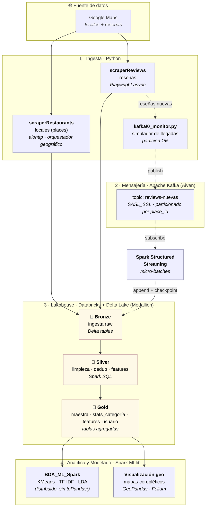

# bda-pi · Big Data Analytics de Reseñas Gastronómicas del Perú

Pipeline **end-to-end de Big Data** sobre el sector gastronómico peruano: desde la
ingesta masiva de locales y reseñas de Google Maps, hasta el procesamiento con
arquitectura Medallion, el modelado ML distribuido y la ingesta en tiempo real
con Kafka + Spark Structured Streaming.

> Proyecto académico — Universidad del Pacífico (UP), curso de Big Data Analytics.

---

## 🏗️ Arquitectura

Diagrama de **componentes lógicos** (qué hace cada etapa) anotados con sus
**componentes tecnológicos** (con qué se implementa). Se distinguen el flujo
**batch** (línea sólida) y el flujo **streaming / tiempo real** (línea punteada).



> **Cómo leerlo:** el batch va `Google Maps → scrapers → Bronze → Silver → Gold → ML/Viz`.
> El streaming (punteado) simula reseñas nuevas que `0_monitor.py` publica en Kafka;
> Spark Structured Streaming las consume y las anexa a Bronze de forma incremental,
> reentrando al mismo lakehouse sin reprocesar el histórico.

| Capa | Componente | Descripción |
|---|---|---|
| **Ingesta 1** | [`scraperRestaurants/`](scraperRestaurants/) | Scraping masivo de locales de Google Maps a nivel nacional (1800+ distritos), con orquestador geográfico, *auto-resume* y ETL a Parquet (ZSTD). |
| **Ingesta 2** | [`scraperReviews/`](scraperReviews/) | Extracción async (Playwright) de reseñas por local; *resume* con razón y *benchmark* recall-aware. |
| **Procesamiento** | [`notebooks/Medallion.ipynb`](notebooks/) | Arquitectura Medallion en Databricks: Bronze → Silver → Gold. |
| **Modelado** | [`notebooks/BDA_ML.ipynb`](notebooks/) · [`BDA_ML_Spark.ipynb`](notebooks/) | Análisis descriptivo y ML (KMeans, TF-IDF, LDA) con scikit-learn y con Spark MLlib distribuido. |
| **Streaming** | [`kafka/`](kafka/) | Ingesta en tiempo real de reseñas nuevas (Kafka/Aiven + Spark Structured Streaming). |

---

## 📦 Estructura del repositorio

```
bda-pi/
├── scraperRestaurants/   # Fase 1 — ingesta de locales (ver su README)
├── scraperReviews/       # Fase 2 — ingesta de reseñas (ver su README)
├── notebooks/            # Medallion + ML (Databricks/Spark)
│   ├── Medallion.ipynb
│   ├── BDA_ML.ipynb
│   └── BDA_ML_Spark.ipynb
├── kafka/                # Streaming en tiempo real (ver su README)
│   ├── 0_monitor.py      #   productor / simulador de llegadas
│   ├── 1_producer.py     #   punto de entrada → delega en 0_monitor.py
│   ├── 2_consumidor.py   #   consumidor Spark Structured Streaming
│   └── README.md
├── dataset/              # datos (ignorados por git: *.csv, *.parquet)
├── docs/                 # reportes
├── requirements.txt      # dependencias generales del proyecto
├── .env.example          # plantilla de variables de entorno
└── .gitignore
```

> **Nota sobre datos:** los archivos `*.csv` / `*.parquet` y `.env` / `*.pem`
> están en `.gitignore` y **no se versionan**.

---

## 🔄 Flujo de datos

1. **Fase 1 — Locales.** `scraperRestaurants` recorre los distritos del Perú y
   consolida los locales en Parquet deduplicado por *Google Place ID*.
2. **Fase 2 — Reseñas.** `scraperReviews` toma esos locales y extrae sus reseñas
   (dataset principal: ~3.4M de reseñas).
3. **Medallion.** Los datos crudos aterrizan en **Bronze**, se limpian y
   enriquecen en **Silver**, y se agregan en **Gold** (tabla maestra
   reseña+local+sentimiento, estadísticas por categoría, features de usuario).
4. **Modelado.** Sobre la capa Gold se corre clustering y *topic modeling*
   (versión pandas/scikit-learn y versión distribuida con Spark MLlib).
5. **Streaming.** `kafka/` simula la llegada de reseñas nuevas y las procesa en
   tiempo real, alimentando la capa Bronze de forma incremental.

---

## 🚀 Instalación

```bash
# Clonar
git clone <repo-url>
cd bda-pi

# Entorno (Conda recomendado, Python 3.11)
conda create -n bda-pi python=3.11 -y
conda activate bda-pi

# Dependencias generales
pip install -r requirements.txt

# Para el scraper de reseñas (Playwright)
playwright install chromium
```

Cada submódulo (`scraperRestaurants/`, `scraperReviews/`, `kafka/`) tiene su
propio `README.md` con instrucciones de uso detalladas.

---

## ⚡ Inicio rápido del streaming

```bash
# 1) Configurar credenciales de Kafka (Aiven)
cp .env.example .env        # y completar KAFKA_PASSWORD

# 2) Simular llegada de reseñas en tiempo real (partición del 1%)
python kafka/0_monitor.py --interval 0.1 --batch-size 20

# 3) Consumir el flujo con Spark Structured Streaming
#    Ejecutar kafka/2_consumidor.py (o el notebook) en Databricks/Spark
```

Detalles completos en [`kafka/README.md`](kafka/README.md).

---

## 🔐 Seguridad

- Las credenciales (Kafka/Aiven) se gestionan vía variables de entorno (`.env`),
  **nunca hardcodeadas**. Usa [`.env.example`](.env.example) como plantilla.
- `.env` y `*.pem` están en `.gitignore`. Si alguna credencial se expuso, **rótala**.

---

## 🛠️ Stack tecnológico

`Python` · `aiohttp` · `Playwright` · `Polars` · `pandas` · `Apache Spark` ·
`Spark MLlib` · `scikit-learn` · `Delta Lake` · `Apache Kafka (Aiven)` ·
`Databricks` · `GeoPandas` / `Folium`

---

> Uso educativo y de investigación. Respetar los Términos de Servicio de Google
> y usar de forma responsable.
