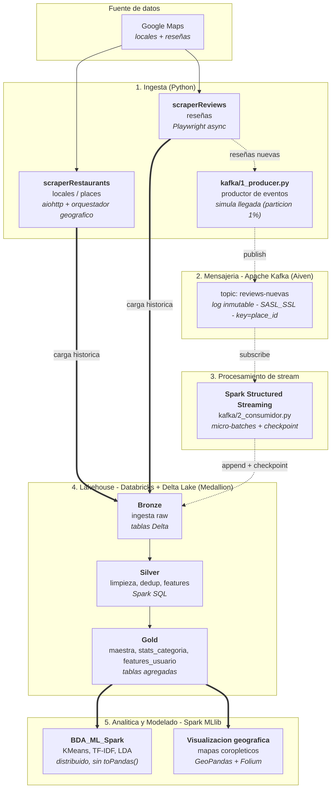

# bda-pi — Big Data Analytics de Reseñas Gastronómicas del Perú

Pipeline de datos de extremo a extremo sobre el sector gastronómico peruano: ingesta
masiva de locales y reseñas de Google Maps, consolidación bajo una **arquitectura
Lambda** con metodología **Medallion** (Bronze/Silver/Gold) sobre Databricks y Delta
Lake, modelado analítico distribuido con Spark MLlib e ingesta incremental en tiempo
real mediante Apache Kafka y Spark Structured Streaming.

Proyecto académico — Universidad del Pacífico (UP), curso de Big Data Analytics.

---

## Arquitectura

El proyecto implementa una **arquitectura Lambda** sobre un mismo lakehouse Delta,
en la que el patrón **Medallion** (Bronze/Silver/Gold) organiza la calidad
progresiva de los datos *dentro* de la capa batch (el medallón es el esquema de
datos, no la arquitectura). El diagrama muestra los componentes lógicos (qué hace
cada etapa) anotados con sus componentes tecnológicos (con qué se implementa). La
línea sólida representa la **capa batch**; la línea punteada, la **capa de
velocidad (streaming)**.



### Capa batch

La carga histórica (los ~3.4 M de reseñas ya scrapeadas) se ingesta directamente a la
capa Bronze y se procesa por reprocesamiento completo a través de Bronze → Silver →
Gold. Es la vía de alto volumen y alta latencia: produce las tablas Gold sobre las que
corren los modelos y los análisis.

### Capa de velocidad (streaming)

Para los datos nuevos, la **capa de velocidad** ingiere las reseñas en tiempo casi
real: un productor publica en un **topic de Kafka** y Spark Structured Streaming las
consume en micro-lotes, aplicando un filtro anti-duplicados (hash por registro)
contra el histórico antes de escribirlas en una tabla Bronze de *streaming*. Es la
vía de baja latencia y volumen incremental, complementaria al reprocesamiento batch
del histórico.

---

## Arquitectura Lambda

La arquitectura **Lambda** combina dos rutas de procesamiento complementarias sobre
una capa de servicio común:

- **Capa batch.** Procesa el **histórico masivo** (~3.4 M de reseñas ya scrapeadas)
  por reprocesamiento completo a través del medallón Bronze → Silver → Gold. Es la
  vía de alto volumen y mayor latencia que produce las vistas analíticas estables.
- **Capa de velocidad (speed layer).** Atiende las **reseñas nuevas** con baja
  latencia: Kafka como log de eventos y Spark Structured Streaming como consumidor,
  con *checkpointing* y un filtro anti-duplicados (hash por registro) contra el
  histórico.
- **Capa de servicio.** Ambas rutas se **reconcilian** al regenerar Silver (unión y
  deduplicación de histórico + stream), de modo que las vistas **Gold** reflejan
  siempre el estado más actual y son el punto único de consumo para los modelos y
  la analítica.

Lo que define la arquitectura como Lambda es esta coexistencia **batch + velocidad
(streaming con Kafka)**; el patrón **Medallion** es únicamente el esquema de calidad
de datos *dentro* de la capa batch, no la arquitectura en sí. La orquestación se
realiza con **jobs de Databricks**, que disparan el reproceso de Silver/Gold tras la
ingesta del stream.

> Nota de implementación: la reconciliación se materializa en el lakehouse (al
> regenerar Silver/Gold), no como una fusión en tiempo de consulta. Esto mantiene una
> única representación de los datos aguas abajo y reduce la duplicación de lógica
> entre rutas, ya que ambas comparten el mismo motor (Spark) y formato (Delta Lake).

---

## Estructura del repositorio

```
bda-pi/
├── scraperRestaurants/   # Fase 1 - ingesta de locales (README propio)
├── scraperReviews/       # Fase 2 - ingesta de reseñas (README propio)
├── notebooks/            # Medallion + modelado (Databricks / Spark)
│   ├── Medallion.ipynb       # Bronze -> Silver -> Gold
│   ├── BDA_ML_Spark.ipynb    # ML distribuido (Spark MLlib) - version oficial
│   └── BDA_ML.ipynb          # ML en pandas/scikit-learn - version de referencia
├── kafka/                # Ingesta en tiempo real (capa de velocidad)
│   ├── 1_producer.py         # productor de eventos (simula llegadas desde la particion 1%)
│   ├── 2_consumidor.py       # consumidor Spark Structured Streaming
│   └── README.md
├── streamlit/            # App de demostracion (KPIs, consultas en vivo, inferencia)
│   ├── app.py                # interfaz Streamlit
│   ├── lib.py                # datos (Polars) + modelos ligeros (scikit-learn)
│   └── requirements.txt
├── dataset/              # datos (ignorados por git: *.csv, *.parquet)
├── docs/                 # reportes
├── requirements.txt      # dependencias generales del proyecto
├── .env.example          # plantilla de variables de entorno
└── .gitignore
```

Nota sobre datos: los archivos `*.csv` / `*.parquet` y `.env` / `*.pem` están en
`.gitignore` y no se versionan.

---

## Componentes

| Capa | Componente | Descripción |
|---|---|---|
| Ingesta 1 | [`scraperRestaurants/`](scraperRestaurants/) | Scraping de locales de Google Maps a escala nacional (más de 1800 distritos) con orquestador geográfico, *auto-resume* y ETL a Parquet (ZSTD). |
| Ingesta 2 | [`scraperReviews/`](scraperReviews/) | Extracción asíncrona (Playwright) de reseñas por local, con *resume* por estado y *benchmark* orientado a *recall*. |
| Procesamiento | [`notebooks/Medallion.ipynb`](notebooks/) | Arquitectura Medallion en Databricks: Bronze → Silver → Gold sobre Delta Lake. |
| Modelado | [`notebooks/BDA_ML_Spark.ipynb`](notebooks/) | Segmentación de usuarios (KMeans) y *topic modeling* (TF-IDF + LDA) distribuidos con Spark MLlib, más visualización geográfica. |
| Streaming | [`kafka/`](kafka/) | Ingesta incremental de reseñas nuevas (Kafka/Aiven + Spark Structured Streaming). Detalle en su [README](kafka/README.md). |
| Demo | [`streamlit/`](streamlit/) | App interactiva: KPIs del corpus, consultas en vivo, galería de resultados e inferencia de los modelos (segmentación y tópicos). Detalle en su [README](streamlit/README.md). |

---

## Flujo de datos

1. **Locales (Fase 1).** `scraperRestaurants` recorre los distritos del Perú y consolida
   los locales en Parquet, deduplicados por Google Place ID.
2. **Reseñas (Fase 2).** `scraperReviews` toma esos locales y extrae sus reseñas
   (conjunto principal: ~3.4 M de reseñas).
3. **Medallion (batch).** El histórico aterriza en Bronze, se limpia y enriquece en
   Silver y se agrega en Gold: tabla maestra reseña+local+sentimiento, estadísticas por
   categoría y *features* por usuario.
4. **Modelado.** Sobre la capa Gold se ejecutan *clustering* de usuarios y *topic
   modeling* de reseñas de forma distribuida con Spark MLlib.
5. **Streaming (capa de velocidad).** `kafka/1_producer.py` publica reseñas nuevas en
   el topic de Kafka; el consumidor Spark Structured Streaming las anexa a Bronze de
   forma incremental (con filtro anti-duplicados por hash) y dispara el reproceso de
   Silver/Gold, reconciliando histórico y stream en el mismo lakehouse.

---

## Instalación

```bash
git clone <repo-url>
cd bda-pi

# Entorno (Conda, Python 3.11 recomendado)
conda create -n bda-pi python=3.11 -y
conda activate bda-pi

# Dependencias generales
pip install -r requirements.txt

# Navegadores para el scraper de reseñas (Playwright)
playwright install chromium
```

Cada submódulo (`scraperRestaurants/`, `scraperReviews/`, `kafka/`) incluye su propio
`README.md` con instrucciones de uso detalladas.

---

## Inicio rápido del streaming

```bash
# 1) Configurar credenciales de Kafka (Aiven)
cp .env.example .env          # completar KAFKA_PASSWORD y demás variables

# 2) Publicar reseñas nuevas en tiempo real (desde la partición del 1%)
python kafka/1_producer.py --interval 0.1 --batch-size 20

# 3) Consumir el flujo con Spark Structured Streaming
#    Ejecutar kafka/2_consumidor.py (o el notebook) en Databricks / Spark
```

Detalle completo en [`kafka/README.md`](kafka/README.md).

---

## Demo interactiva (Streamlit)

Una app de [`streamlit/`](streamlit/) resalta lo más destacable del proyecto:

- **Resumen**: KPIs del corpus calculados en vivo (3.4 M reseñas, 1.2 M usuarios,
  calificación media, % de 5 estrellas).
- **Exploración en vivo**: filtros por calificación/palabra y gráficos de
  distribución, volumen mensual y *engagement* textual.
- **Resultados del análisis distribuido**: galería de las figuras generadas por los
  notebooks de Spark/Databricks (geo, temporal, categorías, K-Means, LDA).
- **Inferencia**: predicción del **segmento** de un usuario (K-Means) y del **tópico**
  de una reseña (LDA).

```bash
pip install -r streamlit/requirements.txt
streamlit run streamlit/app.py
```

> Los modelos de la app son versiones locales ligeras (scikit-learn) que **aproximan**
> a los modelos distribuidos (Spark MLlib) del informe; se usan para demostrar la
> inferencia de forma interactiva. Requiere `dataset/reviews_dataset.parquet` (o definir
> `BDA_DATA_PATH`); la galería de resultados funciona sin el dataset.

---

## Seguridad

- Las credenciales (Kafka/Aiven) se gestionan exclusivamente mediante variables de
  entorno (`.env`); no hay valores hardcodeados en el código. Usar
  [`.env.example`](.env.example) como plantilla.
- `.env` y `*.pem` están en `.gitignore`. Si alguna credencial se expuso, debe rotarse
  en la consola de Aiven.

---

## Stack tecnológico

Python, aiohttp, Playwright, Polars, pandas, Apache Spark, Spark MLlib, scikit-learn,
Delta Lake, Apache Kafka (Aiven), Databricks, GeoPandas, Folium, Streamlit.

---

Uso educativo y de investigación. Respetar los Términos de Servicio de Google y usar de
forma responsable.
